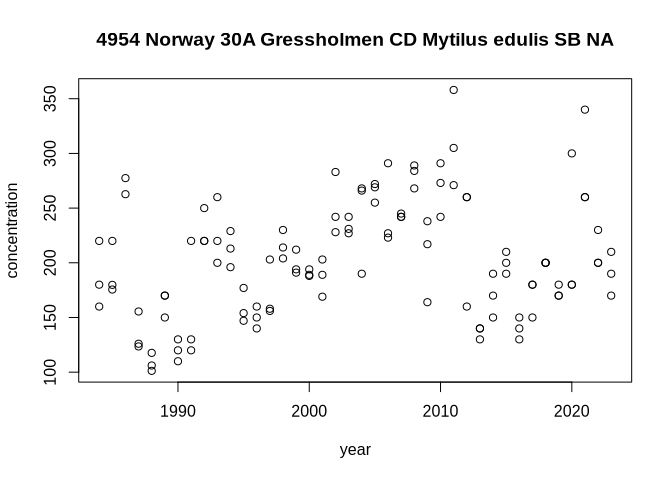
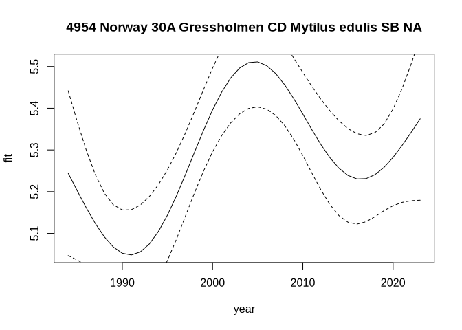
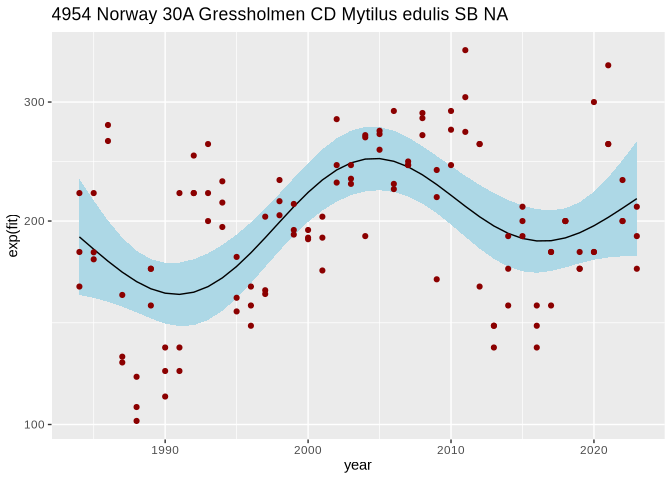

<!-- README.md is generated from README.Rmd. Please edit that file -->

# harsatextras

<!-- badges: start -->
<!-- badges: end -->

The goal of harsatextras is to add some extra functions that extends the
[HARSAT](https://osparcomm.github.io/HARSAT/) package. For the general
HARSAT user, the most useful functions are probably the functions for
extracting plot data for trend plots (`get_assessment_data()`), for
making a ggplot2 trend plot (`ggplot_assessment()`), and for opening a
simple Shiny app for viewing trend plots (`open_assessment_app()`. There
are also some functions that are slightly modified versions of HARSAT
functions, designed for using HARSAT in a
[targets](https://docs.ropensci.org/targets/) pipeline (especially using
static branching).

## Installation

You can install the development version of harsatextras from
[GitHub](https://github.com/) with:

``` r
# install.packages("devtools")
devtools::install_github("DagHjermann/harsatextras")
```

## Example: extracting the data needed for making a time series plot

This is a basic example which shows you how to extract the plot data
from an assessment object (i.e. the output of
`harsat::run_assessment()`). We will here use the built-in object
`assessment_part1`.

``` r

library(harsatextras)
plotdata <- get_assessment_data(assessment_part1)
```

The `plotdata` object contains a list with one item per time series:

``` r
str(plotdata, 1)
#> List of 2
#>  $ 4954 CD Mytilus edulis SB NA:List of 5
#>  $ 4994 CD Gadus morhua LI NA  :List of 5
```

Each list item is a list containing `data` (the raw data), `assessment`
(also a list, containing the results of the assessment), the metadata
for the series (`series`) and for the whole data set (`info`), and the
series name (`output_id`). For instance, here is the contents for time
series number 1:

``` r
i <- 1
str(plotdata[[i]], 1)
#> List of 5
#>  $ data      :'data.frame':  119 obs. of  37 variables:
#>  $ assessment:List of 14
#>  $ series    :'data.frame':  1 obs. of  20 variables:
#>  $ info      :List of 20
#>  $ output_id : chr "4954 Norway 30A Gressholmen CD Mytilus edulis SB NA"
```

We can plot the raw data using the following command (for simplicity, we
ignore the ‘cencoring’ column, thereby ignoring to separate between data
over LOQ and data under LOQ):

``` r

plot(concentration ~ year, plotdata[[i]]$data, 
     main = plotdata[[i]]$output_id)
```



The data needed for making a trend plot are found in `assessment`, in
the `pred` item. In this case (as for most chemical parameters), the y
axis reflects that the trend assessment has been performed on
log-transformed data:

``` r

plot(fit ~ year, plotdata[[i]]$assessment$pred, 
     main = plotdata[[i]]$output_id,
     type = "l")
lines(ci.lower ~ year, plotdata[[i]]$assessment$pred, 
     type = "l", lty = "dashed")
lines(ci.upper ~ year, plotdata[[i]]$assessment$pred, 
     type = "l", lty = "dashed")
```


The statistical distribution used for assessment data can be found here:

``` r

plotdata[[1]]$series$distribution
#> [1] "lognormal"
```

The following is an example plot of both raw data and trend lines using
ggplot2:

``` r

library(ggplot2)
#> Warning: package 'ggplot2' was built under R version 4.3.3

ggplot(plotdata[[i]]$assessment$fullData, aes(year)) +
  geom_ribbon(
    data = plotdata[[i]]$assessment$pred,
    aes(ymin = exp(ci.lower), ymax = exp(ci.upper)),  # note; hard-coded exp
    fill = "lightblue") +
  geom_path(
    data = plotdata[[i]]$assessment$pred,
    aes(y = exp(fit))) +
  geom_point(
    aes(y = concentration, color = censoring),
    color = "darkred") +
  scale_y_log10() +
  labs(title = plotdata[[i]]$output_id)
```


